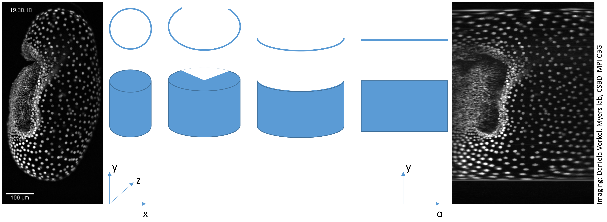
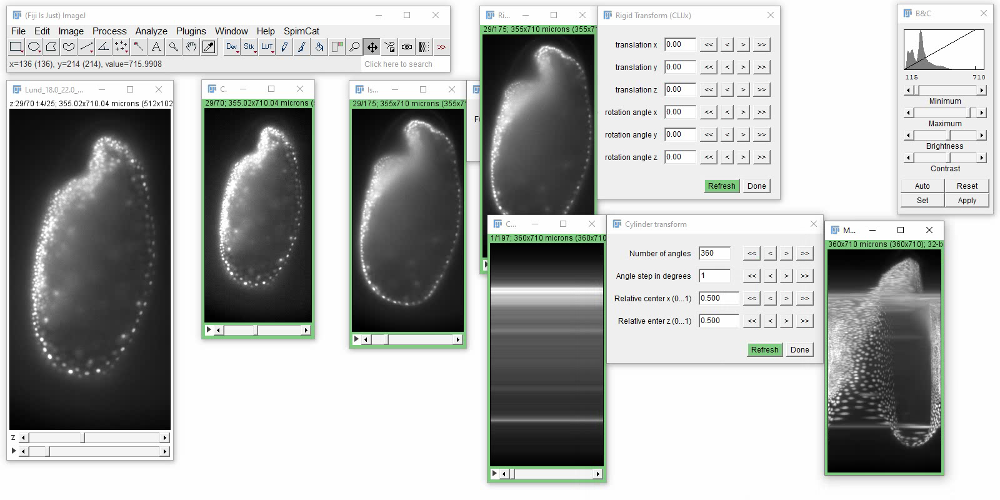
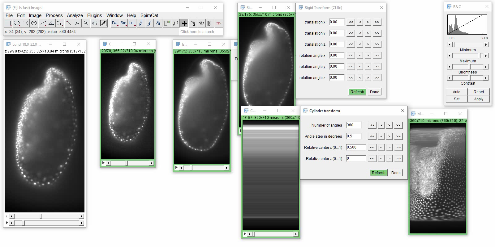

# Cylinder projection
The cylinder projection is typically used to project intensities from a spherical or cylindrical sample into a 2D image.

## How to use a cylinder projection on your data
When applying cylinder projections to image stacks, a rigid dransform in advance is helpful to have control of the position and tilt of your sample in projected space.

Open your time lapse data set. [Start the CLIJx-Assistant](https://clij.github.io/assistant/getting_started) and follow these steps:

* Your dataset
  * CLIJx-Assistant Starting point
    * [Optional: Noise removal and Background subtraction]
      * Make Isotropic
        * Rigid transform
          * Cylinder transform
            * Maximum Z projection

<iframe src="images/cylinder_transform_drosophila.mp4" width="540" height="540"></iframe>
[Download video](images/cylinder_transform_drosophila.mp4)

## Half-cylinder projection
If just half of a sample was imaged, you may want to apply a half-cylinder projection. 
In the maximum projection, full-cylinder projections of half-embryos also look suspicious:

You can turn a full-cylinder projection by changing the center of the transform and the number of angles to 180 or the angle step to 0.5 degrees.

The detailed procedure is shown in this video:
<iframe src="images/cylinder_half_tribolium.mp4" width="600" height="300"></iframe>
[Download video](images/cylinder_half_tribolium.mp4) [Image data source: Daniela Vorkel, Myers lab, CSBD / MPI CBG]

Back to [CLIJx-Assistant](https://clij.github.io/assistant)

[Imprint](https://clij.github.io/imprint)
