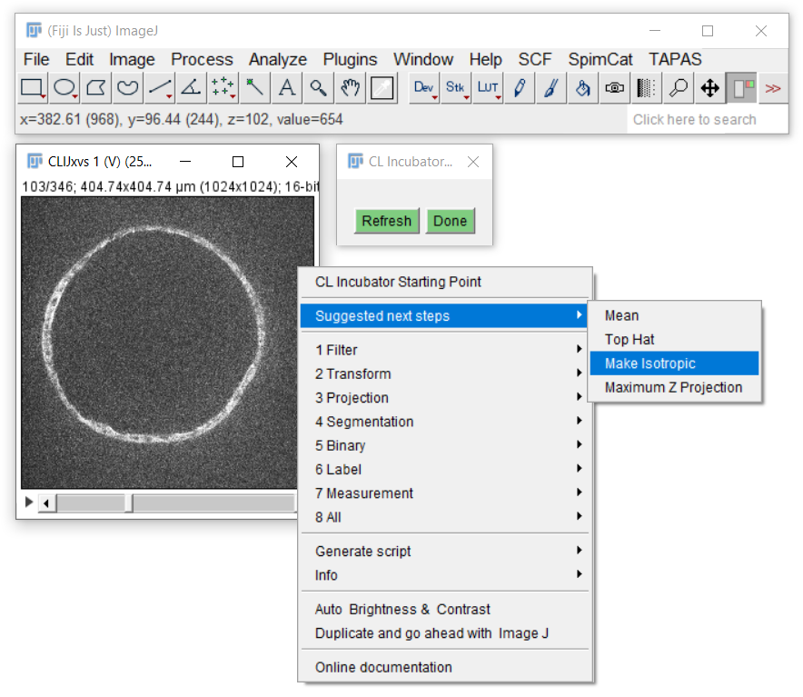
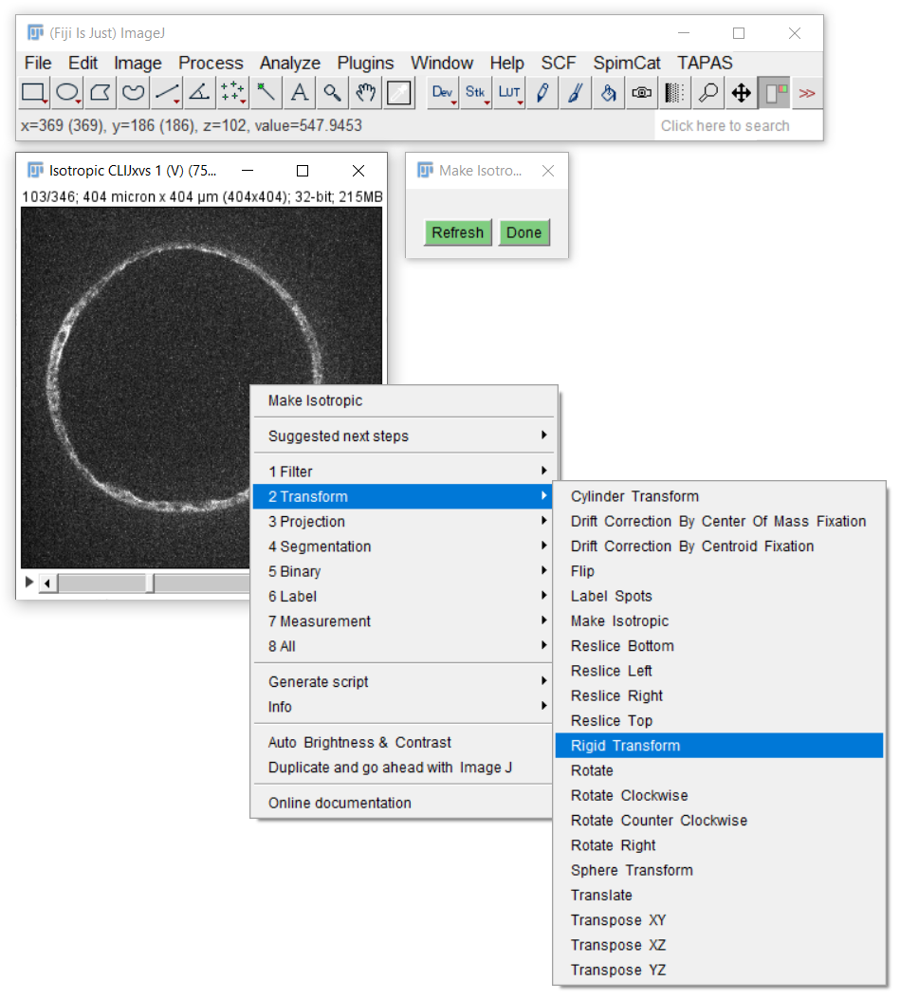
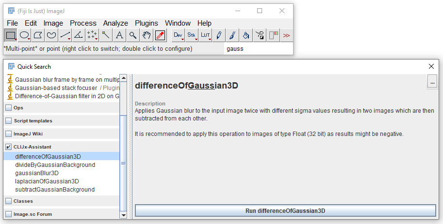
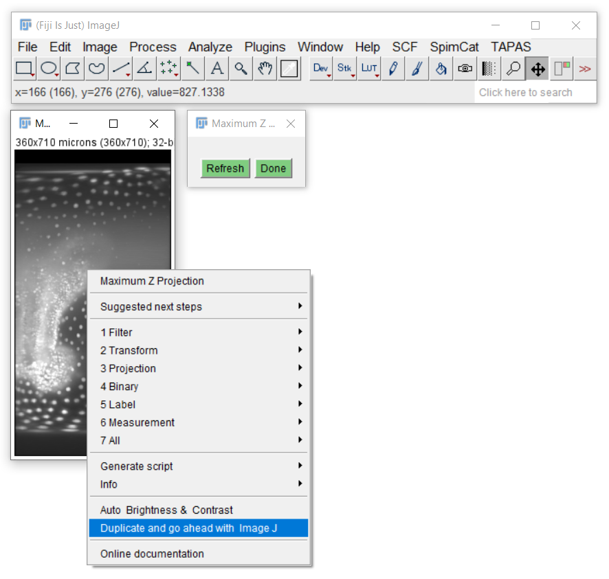

# Getting started desinging image processing workflows with the CLIJx Assistant
Open your 3D+channel+time data set. Consider opening it as [virtual stacks](https://imagej.nih.gov/ij/docs/guide/146-8.html)
if it's huge. Afterwards, activate CLIJx-Assistant by clicking on its tool icon.

## Building workflows - step by step
CLIJx-Assistant has a built-in suggestions of what to do next: 
Just right click in any image that has the assistant attached.

 
[Image data source: Irene Seijo Barandiaran, Grapin-Botton lab, MPI CBG]

Consider the suggestions but also explore the cateories of all available operations. 

[Image data source: Irene Seijo Barandiaran, Grapin-Botton lab, MPI CBG]

You also find all CLIJx-Assistant operations in Fijis search bar. They have their own category to not be mixed up with
CLIJ2 operations:

## Interoperabilty with classical ImageJ and Fiji operations
As CLIJx-Assistant runs in classical ImageJ windows, you can use ImageJ operations on the shown images. 
However, they may be overwritten as soon as CLIJx-Assistant recomputes its results.
Thus, it is recommended to duplicate an image before applying classial functions to it. 
You can use ImageJs `Duplicate...` menu or the built in menu:

## The assistant in action
<iframe src="images/window_positioning.mp4" width="540" height="540"></iframe>
[Download video](images/window_positioning.mp4)

Back to [CLIJx-Assistant](https://clij.github.io/assistant)

[Imprint](https://clij.github.io/imprint)

