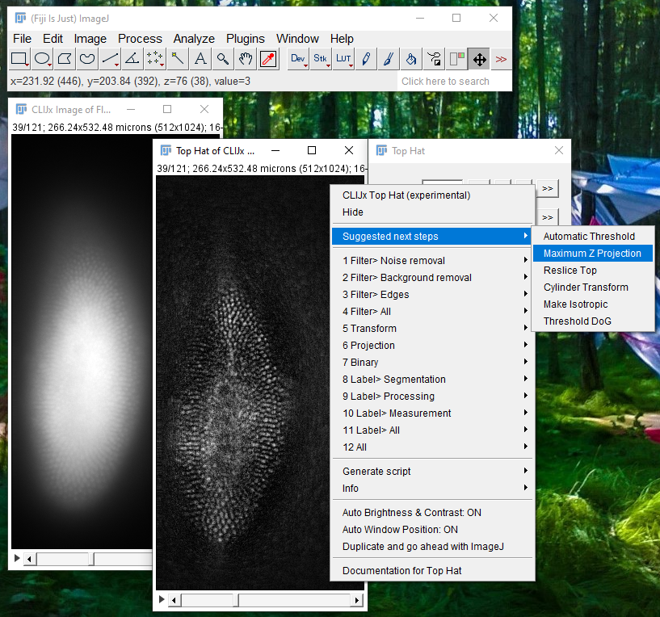

# CLIJx-Assistant
[CLIJx-Assistant](https://clij.github.io/assistant) is an intuitive user interface for building custom GPU-accelerated image processing workflows using [CLIJ2](https://clij.github.io) in [Fiji](https://fiji.sc) and an interactive compute graph. 
It suggests what to do next, optimizes parameters automatically and generates scripts and human readable protocols to facilitate reproducing workflows.

CLIJx-Assistant is under development and is subject to change. 
Please treat everything with care.
Do not use it for routine research yet. 
Planned release is early 2021. 
Stay tuned.

## Overview
* Introduction
  * [Installation](https://clij.github.io/assistant/installation)
  * [Building workflows](https://clij.github.io/assistant/getting_started)
  * [Parameter optimization](https://clij.github.io/assistant/parameter_optimization)
  * [Undo parameter changes](https://clij.github.io/assistant/undo)
  * [Reference](https://clij.github.io/assistant/reference)

* Filtering / correction
  * [Image filtering](https://clij.github.io/assistant/filtering)
  * [Drift correction](https://clij.github.io/assistant/drift_correction)
  * Intensity correction

* Transformation
  * [Maximum projection](https://clij.github.io/assistant/intensity_projection)
  * [Crop, Pan & zoom](https://clij.github.io/assistant/crop_pan_zoom)
  * [Multi-channel image visualisation](https://clij.github.io/assistant/multi_channel_support)
  * [Cylinder projection](https://clij.github.io/assistant/cylinder_projection)
  * [Sphere projection](https://clij.github.io/assistant/sphere_projection)

* Regionalisation
  * Spot detection
  * Cell segmentation
    * [Nuclei segmentation](https://clij.github.io/assistant/segmentation_nuclei)
    * [Cell segmentation based on membranes](https://clij.github.io/assistant/segmentation_cells)
    * [Pixel classifier (Weka)](https://clij.github.io/assistant/clijx_weka_pixel_classifier)

* Analysis
  * [Cell neighbor analysis](https://clij.github.io/assistant/neighbor_analysis_generated)
  * [Distance analysis using MorholibJ](https://clij.github.io/assistant/morpholibj_chamfer_distance_map)
  * [Label classifier (Weka)](https://clij.github.io/assistant/clijx_weka_label_classifier)

* Reproducibility
  * [Export workflows as ImageJ Script](https://clij.github.io/assistant/macro_export)
  * [Supplementary methods section generator](https://clij.github.io/assistant/supplementary_methods_section_generator)
  * [Generate CLIJx / Fiji plugins](https://clij.github.io/assistant/generate_clijx_plugins)
  * [Export workflows as Python script using clEsperanto and Napari](https://clij.github.io/assistant/te_oki_export)

* Extensibility
  * [CLIJ2 Plugin template](https://github.com/clij/clij2-plugin-template)
  * [CLIJ2 imglib2 example plugin](https://github.com/clij/clijx-assistant-imglib2)
  * [CLIJ2 ImageJ example plugin](https://github.com/clij/clijx-assistant-imagej)
  * [CLIJ2 ImageJ2 example plugin](https://github.com/clij/clijx-assistant-imagej2)
  * [CLIJ2 BoneJ example plugin](https://github.com/clij/clijx-assistant-bonej)
  * [CLIJ2 MorphoLibJ example plugin](https://github.com/clij/clijx-assistant-morpholibj)
  * [CLIJ2 ImageJ 3D Suite example plugin](https://github.com/clij/clijx-assistant-imagej3dsuite)

## Instant feedback
You can fine tune parameters of your workflow while inspecting different z-planes or time points of your data set and see results instantly.
<iframe src="images/incubator_segmentation_intro.mp4" width="500" height="800"></iframe>
[Download video](images/incubator_segmentation_intro.mp4) [Image data source: Daniela Vorkel, Myers lab, CSBD / MPI CBG]

## Generate CLIJx / Fiji plugins from windows on screen
After a workflow has been set up, you can generate a new CLIJx / Fiji plugin and use it to spare steps in future workflows.
<iframe src="images/generate_clijx_plugins3_acc.mp4" width="500" height="250"></iframe>
[Download video](images/generate_clijx_plugins3_acc.mp4)

## Wish list and known issues
* Add menu entry for "Apply to all time points"
* If a plugin has three parameters, e.g. "sigma_x", "sigma_y" and "sigma_z", allow to change these three together with one click.
* Make dialogs use physical units in general or switchable between pixel units and physical units.

Also have an idea for improving CLIJx-Assistant? Let me know! I'm eager to receiving feedback: rhaase at mpi minus cbg dot de

[Imprint](https://clij.github.io/imprint)
