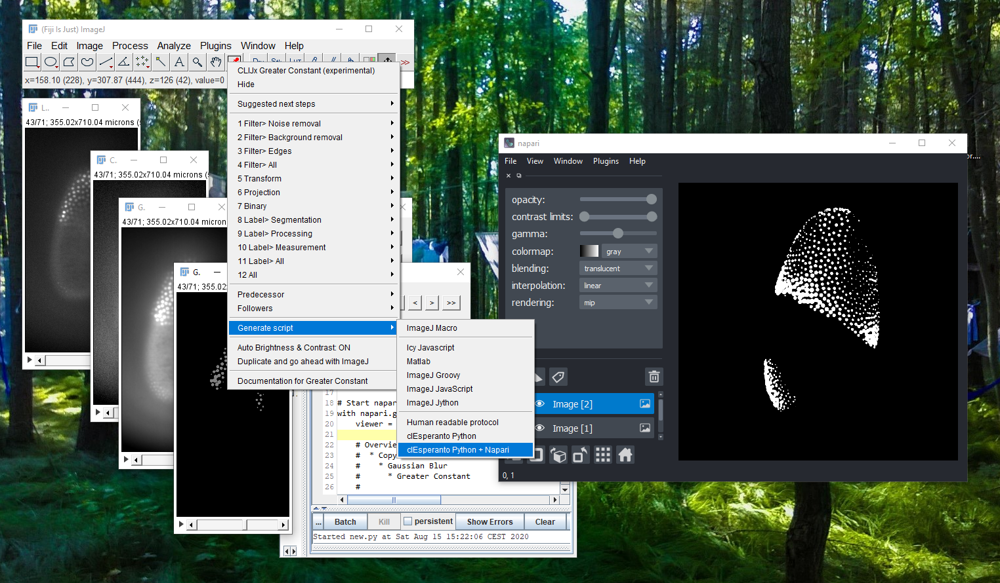
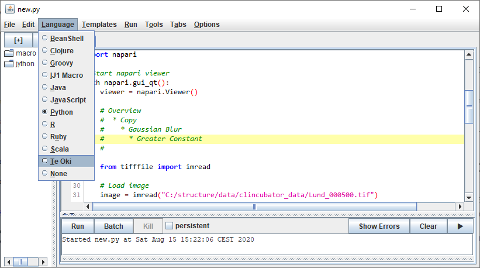

# Exporting workflows as Python script using clEsperanto and Napari
After you finished designing your image analysis workflow, you can export a python script which uses Napari 
for visualisation and execute if from Fijis script editor.



## Configuration
On top of CLIJx-incubator [installation](https://clij.github.io/incubator/installation) instructions, 
please install a conda environment, e.g. via [mini-conda]().

Using conda, create a conda environment e.g. named te_oki:
```
conda create --name te_oki 
```
Activate the environment: 
```
conda activate te_oki 
```
Install dependencies, either via conda install or
```
pip install pyopencl napari matplotlib numpy pyclesperanto_prototype 
```
Within this environment you can run generated clEsperanto python scripts.

## Executing python from Fiji: Te Oki
If you want to run the generated scripts from Fiji, make sure conda is part of the PATH variable. 
You can configure which conda environment is used in Fijis menu 
Plugins > ImageJ on GPU (CLIJx-Incubator) > Options >Conda configuration (Te Oki)

Furthermore, activate the scripting language Te Oki in Fijis script editor to run the generated script:


## Note
Not all commands have been translate to python yet. You can get an overview about supported and 
yet missing operations in [this list]().

Stay tuned and check out http://clesperanto.net to learn more.

## Usage

<iframe src="images/te_oki_fast.mp4" width="540" height="260"></iframe>
[Download video](images/te_oki.mp4) [Image data source: Daniela Vorkel, Myers lab, CSBD / MPI CBG]

**Please note:** While CLIJx-Incubator is running, the GPU may be busy and full of images. 
Thus, before running your generated macro, close all CLIJx-Incubator windows.

Back to [CLIJx-Assistant](https://clij.github.io/assistant)